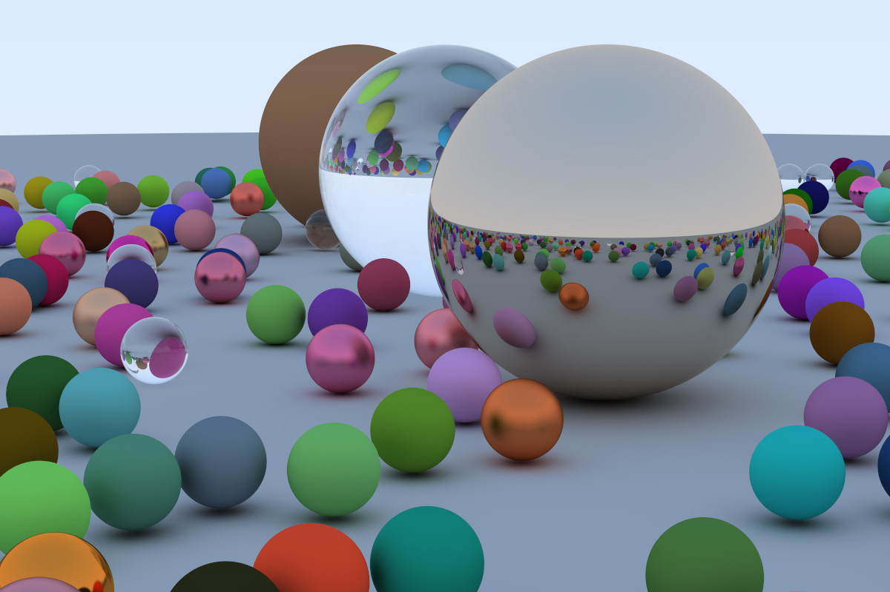

# Path Tracer

Development of a Path Tracer on my free time based on Peter Shirley's ray tracing book series.

The project goal was to learn the basics of ray/path tracing algorithm through C++ implementation.

<ins>**Figure 1:**</ins> random scene render with 5000 samples and 50 bounces

During my journey into ray tracing with those books, I learned a lot of things and not only on ray tracing. In general, explanations in the book are rather concise. And since I want to have a clear understanding of how things work I also used resources on the internet to delve into certain topics.

I learned about **Acceleration Structure** and more specifically **Bounding Volume Hierarchy**: how it works, why we need it in rendering and how to implement it. I used Axis-Aligned Bounding Box (AABB) and a binary tree for the BVH.

I understood how **Noises** work in general with a focus on **Perlin Noise**.

<ins>**Figure 2:**</ins> complexe scene render with 10000 samples and 50 bounces

